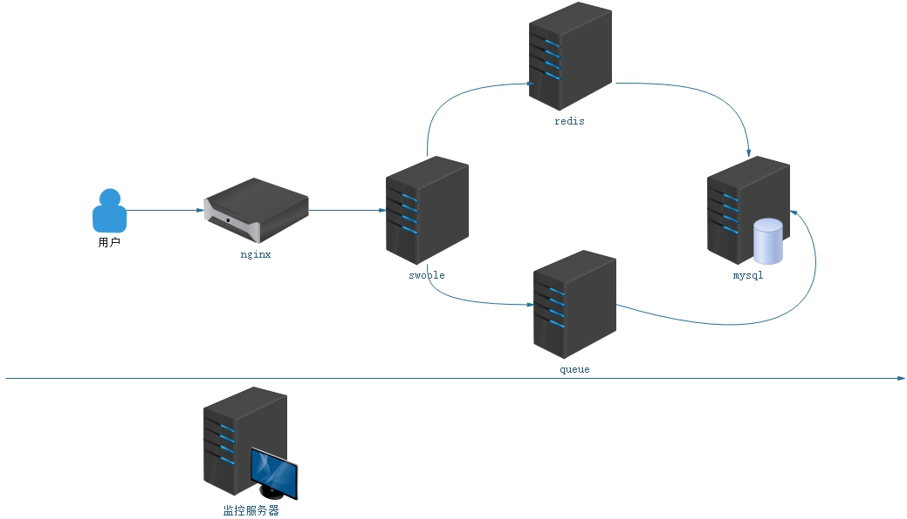

# seckill

base php hyperf seckill system 

### 环境说明

 - PHP >= 7.2
 - Swoole PHP extension >= 4.4，and Disabled `Short Name`
 - OpenSSL PHP extension
 - JSON PHP extension
 - PDO PHP extension （If you need to use MySQL Client）
 - Redis PHP extension （If you need to use Redis Client）
 - Protobuf PHP extension （If you need to use gRPC Server of Client）

### 任务需求

- [ ] 编排docker-php-swoole镜像
- [ ] 编排docker-mysql单机以及
- [ ] 编排docker-mysql集群、系统监控数据上报
- [ ] 编排docker-redis单机、系统监控数据上报
- [ ] 编排docker-redis集群、系统监控数据上报
- [x] 编排docker-rabbitmq单机、系统监控数据上报
- [ ] 编排docker-rabbitmq集群、系统监控数据上报

- [ ] 用户登录接口
- [ ] 用户注册接口
- [ ] 获取个人信息接口
- [ ] 添加地址接口
- [ ] 删除地址接口
- [ ] 秒杀订单
- [ ] 发送邮件

### HTTP-API

......

### 单机架构

### 集群架构

.......

### 服务镜像

[docker-php-swoole]()
[docker-mysql]()
[docker-redis]()
[docker-rabbitmq]() 